# Execution Plan

## Detailed Analysis Summary

### Change Impact Assessment
- **User-facing changes**: Yes — 全新 CLI + 网页界面
- **Structural changes**: Yes — 全新多组件架构（后端 + 前端）
- **Data model changes**: Yes — 新建事件解析模型和分析报告模型
- **API changes**: Yes — 新建 REST API
- **NFR impact**: Yes — AWS Bedrock 集成、技术栈选型

### Risk Assessment
- **Risk Level**: Medium（多组件协作 + 外部 AI 服务依赖）
- **Rollback Complexity**: Easy（全新项目，无遗留系统影响）
- **Testing Complexity**: Moderate（需 mock Bedrock 调用）

## Workflow Visualization

```mermaid
flowchart TD
    Start(["用户请求"])

    subgraph INCEPTION["🔵 INCEPTION PHASE"]
        WD["工作区检测<br/><b>COMPLETED</b>"]
        RA["需求分析<br/><b>COMPLETED</b>"]
        WP["工作流规划<br/><b>IN PROGRESS</b>"]
        AD["应用设计<br/><b>EXECUTE</b>"]
        UG["工作单元生成<br/><b>EXECUTE</b>"]
    end

    subgraph CONSTRUCTION["🟢 CONSTRUCTION PHASE"]
        FD["功能设计<br/><b>EXECUTE</b>"]
        NFRA["NFR 需求<br/><b>EXECUTE</b>"]
        NFRD["NFR 设计<br/><b>EXECUTE</b>"]
        CG["代码生成<br/><b>EXECUTE</b>"]
        BT["构建与测试<br/><b>EXECUTE</b>"]
    end

    Start --> WD --> RA --> WP --> AD --> UG
    UG --> FD --> NFRA --> NFRD --> CG --> BT --> End(["完成"])

    style WD fill:#4CAF50,stroke:#1B5E20,stroke-width:3px,color:#fff
    style RA fill:#4CAF50,stroke:#1B5E20,stroke-width:3px,color:#fff
    style WP fill:#4CAF50,stroke:#1B5E20,stroke-width:3px,color:#fff
    style AD fill:#FFA726,stroke:#E65100,stroke-width:3px,stroke-dasharray: 5 5,color:#000
    style UG fill:#FFA726,stroke:#E65100,stroke-width:3px,stroke-dasharray: 5 5,color:#000
    style FD fill:#FFA726,stroke:#E65100,stroke-width:3px,stroke-dasharray: 5 5,color:#000
    style NFRA fill:#FFA726,stroke:#E65100,stroke-width:3px,stroke-dasharray: 5 5,color:#000
    style NFRD fill:#FFA726,stroke:#E65100,stroke-width:3px,stroke-dasharray: 5 5,color:#000
    style CG fill:#4CAF50,stroke:#1B5E20,stroke-width:3px,color:#fff
    style BT fill:#4CAF50,stroke:#1B5E20,stroke-width:3px,color:#fff
    style Start fill:#CE93D8,stroke:#6A1B9A,stroke-width:3px,color:#000
    style End fill:#CE93D8,stroke:#6A1B9A,stroke-width:3px,color:#000
    style INCEPTION fill:#BBDEFB,stroke:#1565C0,stroke-width:2px
    style CONSTRUCTION fill:#C8E6C9,stroke:#2E7D32,stroke-width:2px

    linkStyle default stroke:#333,stroke-width:2px
```



### Text Alternative
```
Phase 1: INCEPTION
  - Workspace Detection (COMPLETED)
  - Requirements Analysis (COMPLETED)
  - User Stories (SKIPPED)
  - Workflow Planning (IN PROGRESS)
  - Application Design (EXECUTE)
  - Units Generation (EXECUTE)

Phase 2: CONSTRUCTION (per unit)
  - Functional Design (EXECUTE)
  - NFR Requirements (EXECUTE)
  - NFR Design (EXECUTE)
  - Infrastructure Design (SKIP)
  - Code Generation (EXECUTE)
  - Build and Test (EXECUTE)

Phase 3: OPERATIONS (PLACEHOLDER)
```

## Phases to Execute

### 🔵 INCEPTION PHASE
- [x] Workspace Detection (COMPLETED)
- [x] Requirements Analysis (COMPLETED)
- [x] User Stories (SKIPPED — MVP 项目，单用户，无多角色场景)
- [x] Workflow Planning (IN PROGRESS)
- [ ] Application Design - EXECUTE
  - **Rationale**: 全新项目，需定义组件边界、服务层设计、API 契约、前后端交互
- [ ] Units Generation - EXECUTE
  - **Rationale**: 多组件项目（后端 + 前端 + Mock 数据），需拆分为独立工作单元

### 🟢 CONSTRUCTION PHASE (per unit)
- [ ] Functional Design - EXECUTE
  - **Rationale**: 需定义数据模型（K8s Event、分析报告）、业务规则（事件解析、原因分类）
- [ ] NFR Requirements - EXECUTE
  - **Rationale**: AWS Bedrock 集成、技术栈选型（Spring Boot + Vue）需明确
- [ ] NFR Design - EXECUTE
  - **Rationale**: Bedrock SDK 集成模式、错误处理、超时策略需设计
- [ ] Infrastructure Design - SKIP
  - **Rationale**: MVP 阶段本地运行，无云基础设施部署需求
- [ ] Code Generation - EXECUTE (ALWAYS)
  - **Rationale**: 实现代码
- [ ] Build and Test - EXECUTE (ALWAYS)
  - **Rationale**: 构建验证和测试

### 🟡 OPERATIONS PHASE
- [ ] Operations - PLACEHOLDER

## Estimated Timeline
- **Total Stages to Execute**: 9
- **Stages to Skip**: 3 (User Stories, Infrastructure Design, Operations)

## Success Criteria
- **Primary Goal**: 输入 mock FailedScheduling JSON，输出结构化失败原因分类报告
- **Key Deliverables**:
  - Spring Boot 后端 REST API
  - Vue + Element Plus 前端页面
  - CLI 纯文本输出
  - Mock FailedScheduling 事件样本
- **Quality Gates**:
  - API 能正确解析 mock 事件 JSON
  - Bedrock 调用成功返回分析结果
  - 前端能展示结构化报告
  - CLI 能输出可读文本
