# 使用 AI-DLC 方法论通过 Kiro CLI 开发项目操作指南

> 本文档演示如何将 AI-DLC（AI-Driven Development Life Cycle）方法论与 Kiro CLI 结合，完成一个完整项目的开发流程。

# AI-DLC 方法论介绍

**AI-DLC 定义：**
亚马逊云科技推出 AI 驱动开发方法论 AI-DLC (AI-Driven Development Lifecycle)。与传统软件开发不同，AI-DLC 将 AI 置于开发流程核心，在全程人工监督的前提下，覆盖从构思、构建到运营的完整周期，为每个阶段提供切实可行的 AI 应用方案。

**核心特点：**
AI-DLC 引入了一个根本性转变，即由 AI 发起并引导与人类的对话，而非被动响应人类的指令。从而高效地完成生产级的开发任务，帮助这一方法论，开发团队专注战略决策、AI 负责工作流编排、任务分解、代码编写、测试与部署等具体实施工作。

**采用情况：**
目前，这方法论已在全球范围内助力了包括 **S&P Global**、** Wipro**、**HackerRank** 和 **Dhan** 等企业将 AI 深度融入软件开发流程，将原本需要数月的复杂开发工作压缩至数天乃至数小时。

**活动目的：**
通过本次活动，介绍这一套，为研发团队提供 AI 驱动开发的实践参考，助力团队探索更高效的产品创新与交付路径。

---

## 活动日程表

| 时间段 | 活动名称 | 时长 |
|--------|----------|------|
| 10:00 - 10:10 | 开场致辞 | 10分钟 |
| 10:10 - 10:50 | AI-DLC 方法分享和工作坊介绍 | 40分钟 |
| 10:50 - 11:20 | AI-DLC 流程操作演示 | 30分钟 |
| 11:20 - 12:00 | Kiro CLI/IDE 实践经验分享 | 40分钟 |
| 12:00 - 13:00 | 午餐 | 1小时 |
| 13:00 - 13:40 | 构思阶段指导 | 40分钟 |
| 13:40 - 14:40 | 构思阶段实战 | 1小时 |
| 14:40 - 15:20 | 构建阶段设计 | 40分钟 |
| 15:35 - 17:05 | 构建阶段实战 | 1小时30分钟 |
| 17:05 - 18:00 | 反馈分享与总结 | 55分钟 |

**活动总时长**：8小时（10:00 - 18:00）

---

## AI-DLC 工作流程总览

下图展示了 AI-DLC 的完整三阶段工作流程，帮助你在开始操作前对整体流程有全局认知。

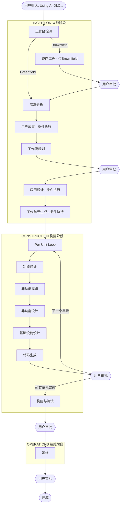
```mermaid
flowchart TD
    START(["用户输入: Using AI-DLC..."])
    START --> WD

    subgraph INCEPTION["INCEPTION 立项阶段"]
        WD["工作区检测"]
        RE["逆向工程 - 仅Brownfield"]
        RA["需求分析"]
        US["用户故事 - 条件执行"]
        WP["工作流规划"]
        AD["应用设计 - 条件执行"]
        UG["工作单元生成 - 条件执行"]
    end

    subgraph CONSTRUCTION["CONSTRUCTION 构建阶段"]
        UNIT_LOOP["Per-Unit Loop"]
        FD["功能设计"]
        NFR_REQ["非功能需求"]
        NFR_DESIGN["非功能设计"]
        INFRA["基础设施设计"]
        CG["代码生成"]
        BT["构建与测试"]
    end

    subgraph OPERATIONS["OPERATIONS 运维阶段"]
        OPS["运维"]
    end

    APPROVE1{{"用户审批"}}
    APPROVE2{{"用户审批"}}
    APPROVE3{{"用户审批"}}
    APPROVE4{{"用户审批"}}
    APPROVE5{{"用户审批"}}

    WD --> |Brownfield| RE
    WD --> |Greenfield| RA
    RE --> APPROVE1
    APPROVE1 --> RA
    RA --> US
    US --> WP
    WP --> APPROVE2
    APPROVE2 --> AD
    AD --> UG
    UG --> UNIT_LOOP
    UNIT_LOOP --> FD
    FD --> NFR_REQ
    NFR_REQ --> NFR_DESIGN
    NFR_DESIGN --> INFRA
    INFRA --> CG
    CG --> APPROVE3
    APPROVE3 --> |"下一个单元"| UNIT_LOOP
    APPROVE3 --> |"所有单元完成"| BT
    BT --> APPROVE4
    APPROVE4 --> OPS
    OPS --> APPROVE5
    APPROVE5 --> END(["完成"])
```

### AI-DLC 各阶段输出成果物

| 阶段 | 输出成果物 | 存放路径 |
|------|-----------|---------|
| 工作区检测 | 工作区分析结果（项目类型、现有代码扫描） | `aidlc-docs/audit.md` |
| 逆向工程 | 业务概览、架构文档、API 文档、组件清单、交互图、技术栈文档、依赖文档 | `aidlc-docs/inception/reverse-engineering/` |
| 需求分析 | 需求澄清问卷、需求规格说明书（含功能需求列表） | `aidlc-docs/inception/requirements/` |
| 用户故事 | 用户画像、用户故事（含验收标准） | `aidlc-docs/inception/user-stories/` |
| 工作流规划 | 执行计划（阶段规划、风险评估、工作流可视化图） | `aidlc-docs/inception/plans/` |
| 应用设计 | 组件定义、组件方法签名、服务编排、组件依赖矩阵、综合设计文档 | `aidlc-docs/inception/application-design/` |
| 工作单元生成 | 工作单元拆分文档（模块划分、构建顺序） | `aidlc-docs/inception/application-design/unit-of-work.md` |
| 功能设计 | 领域实体、业务逻辑模型、业务规则 | `aidlc-docs/construction/{unit}/functional-design/` |
| NFR 需求 | NFR 需求文档、技术栈决策文档 | `aidlc-docs/construction/{unit}/nfr-requirements/` |
| NFR 设计 | 逻辑组件设计、NFR 设计模式 | `aidlc-docs/construction/{unit}/nfr-design/` |
| 基础设施设计 | 基础设施架构、云资源规格 | `aidlc-docs/construction/{unit}/infrastructure-design/` |
| 代码生成 | 源代码、单元测试代码、代码摘要文档 | 项目根目录（代码）+ `aidlc-docs/construction/{unit}/code/`（摘要） |
| 构建与测试 | 构建指令、单元测试指令、集成测试指令、性能测试指令、综合摘要 | `aidlc-docs/construction/build-and-test/` |
| 全流程 | 审计日志（所有用户输入和 AI 响应的完整记录） | `aidlc-docs/audit.md` |
| 全流程 | 工作流状态跟踪（阶段进度、检查点） | `aidlc-docs/aidlc-state.md` |

### 关键决策点：技术栈在哪个阶段选择？

技术栈选择分两步：

1. **需求分析阶段（Inception）** — 初步确定技术方向：通过结构化问卷收集偏好，评估现有技术栈约束（Brownfield），确定大方向（前端框架、后端语言、数据库类型）
2. **NFR需求阶段（Construction）** — 最终确认技术栈：结合性能、安全、扩展性要求做最终决策，明确具体版本和配置

### 自适应深度说明

AI-DLC 不是每次都走完所有阶段，而是根据复杂度自动调整：

| 场景 | 跳过的阶段 |
|------|-----------|
| 简单 Bug 修复 | 用户故事、应用设计、单元生成、NFR系列、基础设施设计 |
| 新功能开发 | 逆向工程（Greenfield）、部分NFR阶段 |
| 全新复杂系统 | 几乎不跳过任何阶段 |
| 已有系统改造 | 逆向工程必须执行 |

---

## 前置条件

- 已安装 [Kiro CLI](https://kiro.dev/docs/cli)
- 已下载 [AI-DLC 规则包](https://github.com/awslabs/aidlc-workflows/releases)，解压到 `~/Downloads/aidlc-rules/`
- macOS / Linux 环境

---

## 第一步：初始化项目并配置 AI-DLC 规则

AI-DLC 通过 Kiro 的 Steering Files 机制加载工作流规则。在项目根目录执行以下命令，将规则文件复制到正确位置：

```bash
# 创建 Kiro steering 目录
mkdir -p .kiro/steering

# 复制核心工作流规则
cp -R ~/Downloads/aidlc-rules/aws-aidlc-rules .kiro/steering/

# 复制详细规则（供核心规则按需引用）
cp -R ~/Downloads/aidlc-rules/aws-aidlc-rule-details .kiro/
```

完成后，项目目录结构如下：

```
<项目根目录>/
├── .kiro/
│   ├── steering/
│   │   └── aws-aidlc-rules/       ← 核心工作流规则
│   └── aws-aidlc-rule-details/    ← 详细规则（按需加载）
```

### 验证规则是否加载成功

在项目目录下启动 kiro-cli：

```bash
kiro-cli chat
```

> 提示：可以加 `--trust-all-tools` 参数跳过所有工具调用的确认提示：
> ```bash
> kiro-cli chat --trust-all-tools
> ```
> 正常模式下，AI 每次执行文件操作或 bash 命令都会弹出 `Allow this action? [y/n/t]:` 确认。加了此参数后全程自动执行，适合演示或对流程已熟悉的场景。建议在 Git 仓库中使用，方便出问题时回退。

进入交互界面后，执行以下命令查看当前已加载的上下文：

```
/context show
```

输出中应包含 `.kiro/steering/aws-aidlc-rules/core-workflow.md` 的条目，表示 AI-DLC 核心工作流规则已成功加载。

也可以直接在 kiro-cli 中提问来验证：

```
What steering files do you have loaded?
```

AI 会列出当前生效的所有 steering 文件。

<!-- 截图占位：/context show 输出结果 -->

> 注意：如果规则未加载，检查 `.kiro/steering/aws-aidlc-rules/core-workflow.md` 文件是否存在，然后重新启动 kiro-cli 会话。

---

## 第二步：启动 Kiro CLI 并选择模型

在项目根目录的终端中执行以下命令启动 kiro-cli：

```bash
kiro-cli
```

启动后会显示 Kiro 的 ASCII 欢迎界面，底部状态栏显示当前模型和套餐信息：

```
Model: auto (/model to change) | Plan: KIRO POWER (/usage for more detail)
```

### 切换模型

输入 `/model` 命令可以查看和切换可用模型：

```
/model
```

kiro-cli 会列出所有可用模型及其 credit 消耗倍率，例如：

| 模型 | 倍率 | 说明 |
|------|------|------|
| claude-sonnet-4.6 | 1.30x | 最新 Claude Sonnet，1M 上下文窗口（推荐） |
| auto | 1.00x | 由系统自动选择最优模型 |
| claude-opus-4.6 | 2.20x | 最新 Claude Opus，1M 上下文窗口 |
| claude-haiku-4.5 | 0.40x | 轻量快速模型 |

使用上下键选择模型，回车确认。演示推荐选择 **claude-sonnet-4.6**，在能力和成本之间取得最佳平衡。

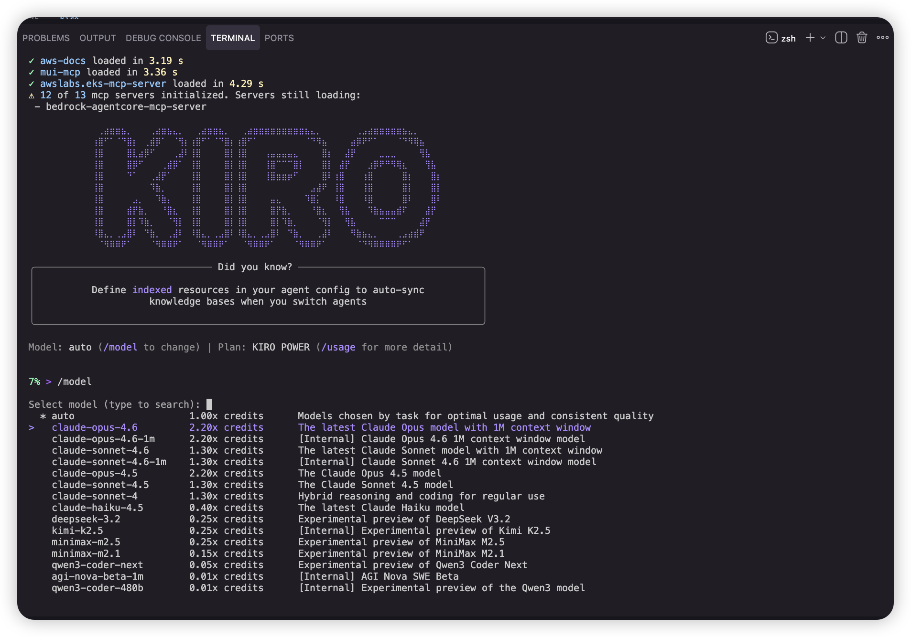

> 提示：也可以在启动后随时用 `/model` 切换，不影响当前会话上下文。

---

## 第三步：触发 AI-DLC 工作流 —— 输入项目意图

模型选择完成后，在 kiro-cli 中输入项目描述，**必须以 `Using AI-DLC,` 开头**，这是触发 AI-DLC 工作流的关键词。

本次演示的输入内容如下：

```
Using AI-DLC, 我想开发一个 Kubernetes Pod 调度失败智能分析工具。

系统监听 Kubernetes 中 Pod 的 FailedScheduling 事件，提取资源请求、node 条件、taints 等信息，
调用 AWS Bedrock 生成结构化分析报告，包括失败原因归类、人话版问题解释和修复建议，
最终通过 CLI 或简单网页输出结果。

MVP 范围：
- 输入：mock 的 FailedScheduling event JSON
- 后端：parse event → 构造 prompt → 调用 Bedrock → 返回分析结果
- 输出：CLI 输出（优先）和网页
```

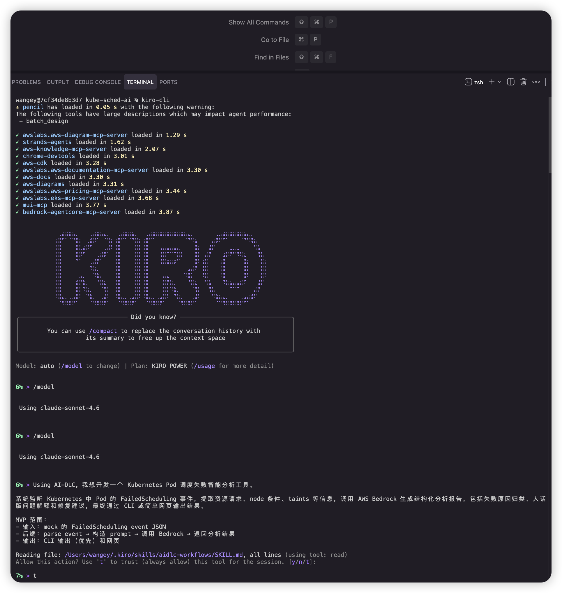

> AI-DLC 识别到 `Using AI-DLC,` 关键词后，会自动激活工作流，进入 Inception 阶段，开始引导整个开发流程。

---

## 第四步：AI-DLC 欢迎界面与工作区检测

提交项目意图后，AI-DLC 工作流自动启动，首先显示欢迎界面，展示完整的三阶段生命周期结构：

```
AI-DLC 三阶段生命周期

用户请求
  ↓
+==================================+
|         INCEPTION 阶段           |
|         规划 & 应用设计           |
|                                  |
| • 工作区检测（ALWAYS）            |
| • 逆向工程（COND）                |
| • 需求分析（ALWAYS）              |
| • 用户故事（CONDITIONAL）         |
| • 工作流规划（ALWAYS）            |
| • 应用设计（CONDITIONAL）         |
| • 工作单元生成（CONDITIONAL）     |
+==================================+
  ↓
+==================================+
|        CONSTRUCTION 阶段         |
|        设计、实现 & 测试          |
|                                  |
| • 每单元循环：                    |
|   - 功能设计（COND）              |
|   - NFR 需求（COND）              |
|   - NFR 设计（COND）              |
|   - 基础设施设计（COND）          |
|   - 代码生成（ALWAYS）            |
| • 构建与测试（ALWAYS）            |
+==================================+
  ↓
+==================================+
|         OPERATIONS 阶段          |
|         部署 & 运行（占位符）     |
+==================================+
```

### 阶段一：工作区检测（自动执行）

欢迎界面展示完毕后，AI-DLC 立即进入第一个阶段——工作区检测，自动扫描当前目录：

- 扫描现有代码结构，判断是全新项目（Greenfield）还是已有项目（Brownfield）
- 检查是否存在 `aidlc-docs/` 目录（用于判断是否有未完成的会话）

本次演示结果：

```
工作区扫描完成。没有发现现有的应用代码，也没有 aidlc-docs/ 目录。
这是一个全新项目（Greenfield）。
```

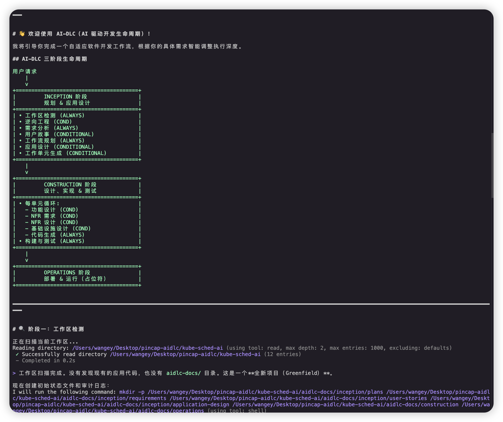

> Greenfield 表示全新项目，AI-DLC 会跳过逆向工程阶段，直接进入需求分析。

---

## 第五步：Inception 阶段 —— 需求分析

工作区检测完成后，AI-DLC 自动进入需求分析阶段。首先输出工作区分析结果：

```
工作区检测完成
- 项目类型：Greenfield（全新项目）
- 现有代码：无
- 逆向工程：不需要
- 下一步：进入需求分析阶段
```

### 需求澄清问卷

AI-DLC 对项目意图做初步分析后，会在 `aidlc-docs/` 目录下自动生成一个澄清问题文件：

```
aidlc-docs/inception/requirements/requirement-verification-questions.md
```

用编辑器打开该文件，可以看到 AI-DLC 针对本项目生成了 7 个问题：

**问题 1**：MVP 阶段调用的 AWS Bedrock 模型是哪个？
- A) Claude 3 Haiku（速度快、成本低）
- B) Claude 3 Sonnet（平衡速度与质量）
- C) Claude 3 Opus（最高质量）

**问题 2**：分析报告的输出格式偏好是什么？
- A) 纯文本（人类可读，适合 CLI 直接展示）
- B) JSON 结构化（方便程序处理和网页渲染）
- C) 两者都要（CLI 输出纯文本，网页用 JSON）

**问题 3**：后端服务的运行方式是什么？
- A) 本地命令行工具（直接运行 Python/Go 脚本）
- B) 本地 HTTP 服务（FastAPI/Flask，CLI 和网页都调用它）

**问题 4**：网页输出的复杂度要求是什么？
- A) 极简：单页 HTML，直接展示分析结果文本
- B) 简单：带基本样式的单页应用，展示结构化报告

**问题 5**：项目的编程语言偏好是什么？
- A) Python（生态丰富，AWS SDK boto3 成熟）
- B) Go（性能好，适合 CLI 工具）
- C) TypeScript/Node.js

**问题 6**：mock 的 FailedScheduling event JSON 是否已有样本？
- A) 已有样本，会在开发时提供
- B) 需要你设计一个符合 Kubernetes 事件格式的 mock 样本

**问题 7**：分析报告需要包含哪些核心内容？（可多选）
- A) 失败原因分类
- B) 人话版问题解释
- C) 具体修复建议（kubectl 命令或配置修改示例）
- D) 受影响的节点列表和状态摘要

### 回答问题

在每个 `[Answer]:` 标签后填写选项，完成后保存文件（`Cmd+S`）。本次演示的回答如下：

| 问题 | 回答 |
|------|------|
| Q1 - Bedrock 模型 | Claude 4.6 Sonnet |
| Q2 - 输出格式 | C）CLI 纯文本 + 网页 JSON |
| Q3 - 后端服务 | OpenJDK 23 + Spring Boot |
| Q4 - 网页前端 | Vue + Element Plus |
| Q5 - 编程语言 | Java（OpenJDK 23） |
| Q6 - Mock 数据 | B）需要设计 mock 样本 |
| Q7 - 报告内容 | A）失败原因分类 |

### 提交回答

文件保存后，回到 kiro-cli 输入：

```
问题回答完毕
```

AI-DLC 会读取问卷文件，汇总所有回答并确认无歧义，然后自动生成需求文档。

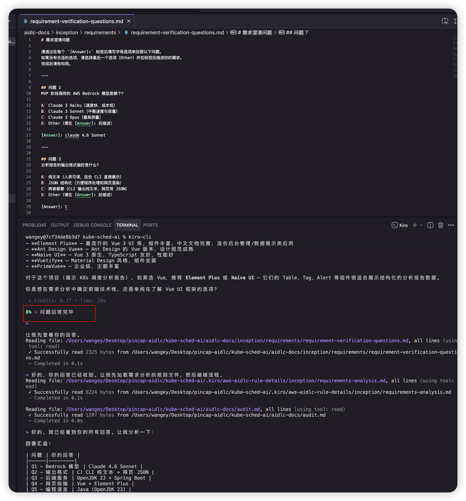

> 截图文件名：`step5-answers-submitted.png`

---

## 第六步：审阅需求文档并确认

AI-DLC 根据问卷回答自动生成需求文档，保存在：

```
aidlc-docs/inception/requirements/requirements.md
```

编辑器会自动打开预览，文档包含以下内容：

- 意图分析摘要（用户画像、请求类型、范围估计、复杂度）
- 功能需求（FR-1 到 FR-6）：
  - FR-1：FailedScheduling 事件解析
  - FR-2：AI 分析引擎
  - FR-3：分析报告 —— 失败原因分类
  - FR-4：双格式输出（CLI 纯文本 + JSON API）
  - FR-5：后端 REST API
  - FR-6：前端界面

终端同时输出需求分析摘要：

```
后端：Java（OpenJDK 23）+ Spring Boot REST API，解析 FailedScheduling 事件并调用 AWS Bedrock Claude 4.6 Sonnet
前端：Vue 3 + Element Plus 单页应用，展示结构化分析报告
双格式输出：CLI 纯文本 + JSON API
核心功能：调度失败原因分类（资源不足 / NodeSelector / Taint / 亲和性冲突）
Mock 数据：需要设计符合 K8s 事件格式的 FailedScheduling 样本
```

### 确认需求并继续

仔细阅读需求文档，确认无误后在 kiro-cli 中输入：

```
Approve & Continue
```

AI-DLC 提供三个选项：
- `Request Changes` —— 要求修改需求文档
- `Add User Stories` —— 增加用户故事阶段
- `Approve & Continue` —— 确认需求，进入工作流规划

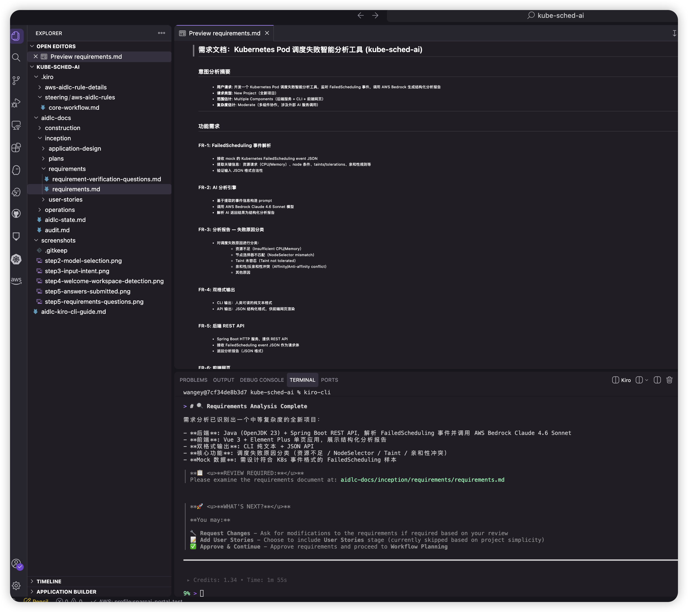

> 截图文件名：`step6-requirements-review.png`

> 这是 AI-DLC "人工在环"原则的体现——每个阶段完成后必须经过人工审核确认，才会进入下一阶段。

---

## 第七步：审阅执行计划并确认

需求确认后，AI-DLC 自动进入工作流规划阶段，生成执行计划文档：

```
aidlc-docs/inception/plans/execution-plan.md
```

执行计划包含详细分析摘要、风险评估和完整的工作流可视化图：

**变更影响评估：**
- User-facing changes：Yes —— 全新 CLI + 网页界面
- Structural changes：Yes —— 全新系统结构（后端 + 前端）
- Data model changes：Yes —— 需要新建事件解析和分析报告数据模型
- API changes：Yes —— 新建 REST API
- NFR impact：Yes —— AWS Bedrock 集成、技术栈选型

**风险评估：**
- Risk Level：Medium（多组件协作 + 外部 AI 服务依赖）
- Rollback Complexity：Easy（全新项目，无遗留系统影响）
- Testing Complexity：Moderate（需 mock Bedrock 调用）

**执行阶段规划（共 10 步）：**

INCEPTION PHASE：
1. 工作区检测 —— 已完成
2. 需求分析 —— 已完成
3. 工作流规划 —— 已完成
4. 应用设计 —— 定义组件边界、API 契约、前后端交互
5. 工作单元生成 —— 拆分为后端 / 前端 / Mock 数据等独立单元

CONSTRUCTION PHASE（per unit）：
6. 功能设计 —— 数据模型、事件解析规则、报告分类逻辑
7. NFR 需求 —— Bedrock 集成、Spring Boot + Vue 技术栈
8. NFR 设计 —— SDK 集成模式、错误处理、超时策略
9. 代码生成 —— 实现代码
10. 构建与测试 —— 构建验证

**推荐跳过阶段：**
- 用户故事 —— MVP 单用户场景，无多角色需求
- 基础设施设计 —— MVP 本地运行，无云部署
- 运维 —— 占位符阶段

### 确认执行计划并继续

仔细阅读执行计划，确认无误后在 kiro-cli 中输入：

```
Approve & Continue
```

AI-DLC 同样提供三个选项：
- `Request Changes` —— 要求修改执行计划
- `Add Skipped Stages` —— 将当前标记为 SKIP 的阶段加回来
- `Approve & Continue` —— 确认计划，进入应用设计阶段

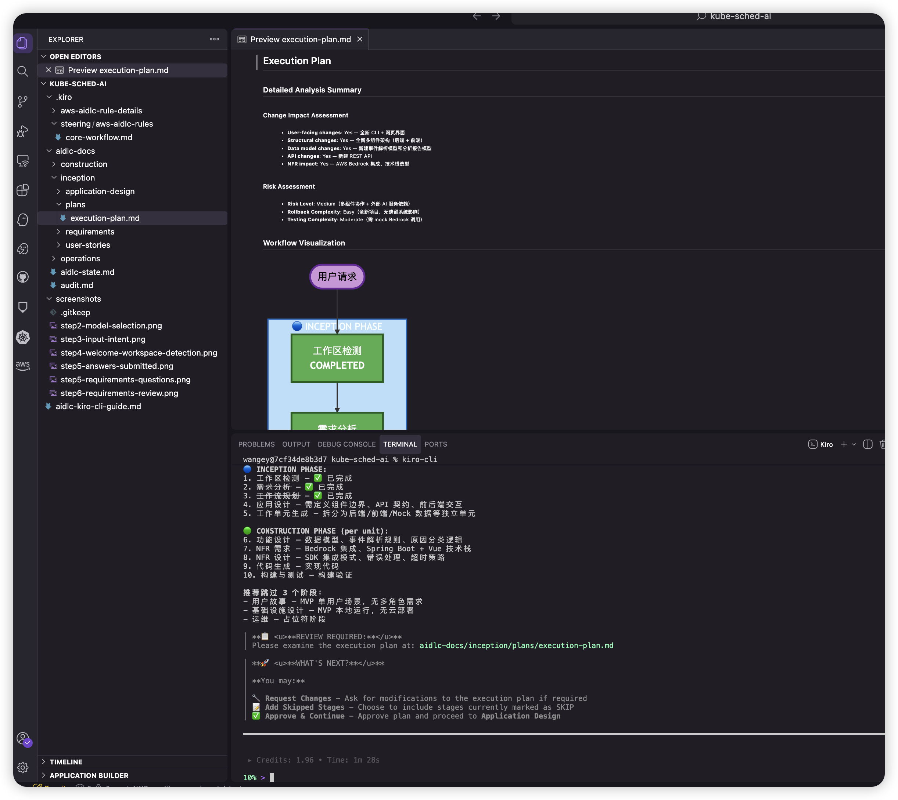

> 截图文件名：`step7-execution-plan.png`

---

## 第八步：应用设计阶段 —— 回答设计问题

执行计划确认后，AI-DLC 进入应用设计阶段，自动生成设计决策问卷：

```
aidlc-docs/inception/plans/application-design-plan.md
```

设计计划包含 5 个步骤：
1. 定义组件及职责
2. 定义组件方法签名
3. 定义服务层编排
4. 定义组件依赖关系
5. 验证设计完整性和一致性

### 回答设计问题

同样在每个 `[Answer]:` 标签后填写选项，本次演示回答如下：

| 问题 | 回答 |
|------|------|
| Q1 - 构建工具 | Maven |
| Q2 - 代码组织 | 前后端分离部署，多仓库 |
| Q3 - API 路径风格 | A）RESTful（`POST /api/v1/analysis`） |
| Q4 - 前后端通信 | A）前端直接调用后端 API（CORS/代理） |
| Q5 - CLI 实现方式 | B）独立 CLI 入口类（单独 main 方法，不启动 Web 服务器） |

填写完成保存文件后，回到 kiro-cli 告知 AI 已完成。

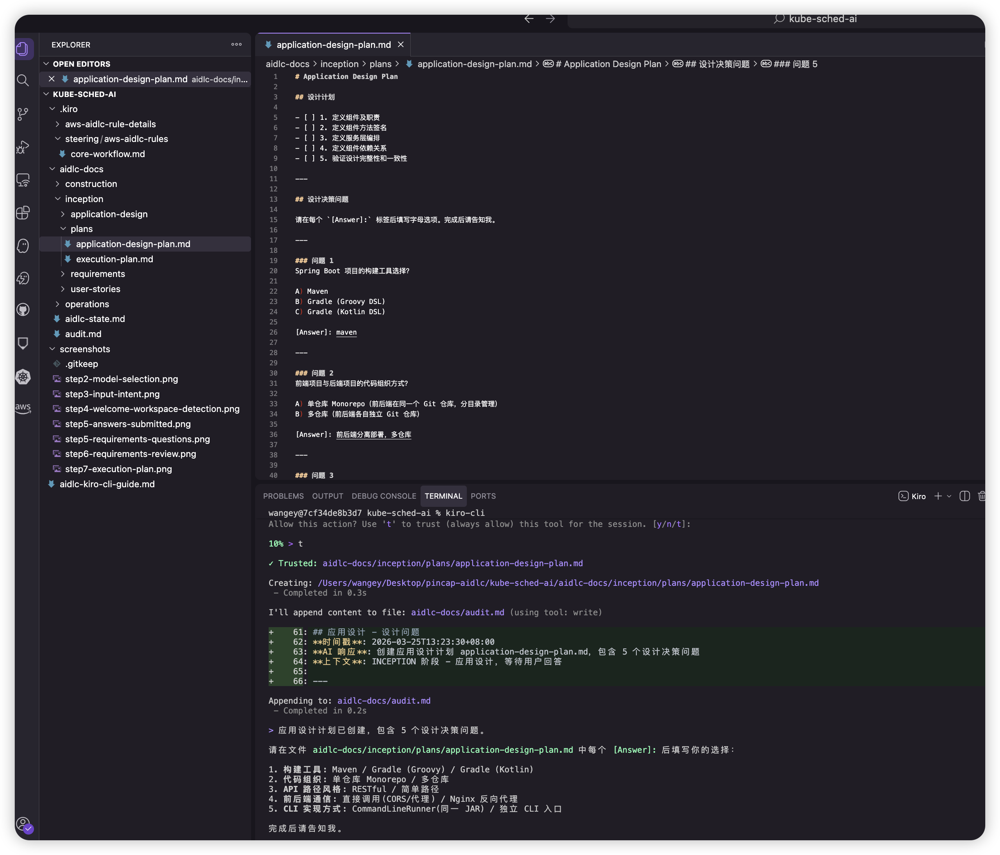

> 截图文件名：`step8-application-design.png`

> 注意截图中终端出现了 `Allow this action? [y/n/t]:` 提示，输入 `t` 信任该工具，后续同类操作不再询问。

---

## 第九步：审阅应用设计文档并确认

回答设计问题后，AI-DLC 自动生成完整的应用设计文档，保存在：

```
aidlc-docs/inception/application-design/
```

生成了以下文件：
- `components.md` —— 7 个核心组件定义
- `component-methods.md` —— 各组件方法签名
- `services.md` —— AnalysisService 编排服务，协调全链路分析流程
- `component-dependency.md` —— 组件依赖矩阵和数据流
- `application-design.md` —— 综合设计文档

### 应用设计内容

编辑器预览中可以看到完整的设计文档，包含：

**技术决策汇总：**

| 决策项 | 选择 |
|--------|------|
| 构建工具 | Maven |
| 代码组织 | 多仓库，前后端分离部署 |
| API 风格 | RESTful（`POST /api/v1/analysis`） |
| 前后端通信 | 前端直接调用后端 API（CORS） |
| CLI 实现 | 独立入口类（不启动 Web 服务器） |

**组件架构（7 个核心组件 + 1 个编排服务）：**

| 组件 | 职责 |
|------|------|
| EventParser | 解析 K8s FailedScheduling event JSON |
| PromptBuilder | 构造 Bedrock prompt |
| BedrockClient | 调用 AWS Bedrock Claude 4.6 Sonnet |
| ReportParser | 解析 AI 返回的结构化报告 |
| ReportFormatter | 格式化输出（JSON / 纯文本） |
| AnalysisController | REST API 端点 |
| CliRunner | 独立 CLI 入口 |
| AnalysisService | 编排服务，协调全链路 |

**数据流：**
```
JSON Input → EventParser → SchedulingFailureInfo → PromptBuilder → [Prompt] → BedrockClient → ...
```

### 确认应用设计并继续

确认无误后在 kiro-cli 中输入：

```
Approve & Continue
```

AI-DLC 提供两个选项：
- `Request Changes` —— 要求修改应用设计
- `Approve & Continue` —— 确认设计，进入工作单元生成阶段

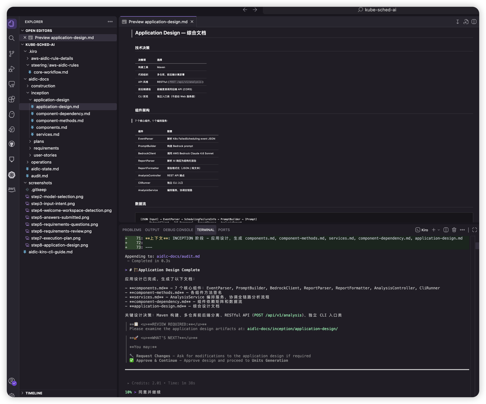

> 截图文件名：`step9-application-design-review.png`

## 第十步：工作单元生成 —— 确定模块结构

应用设计确认后，AI-DLC 进入工作单元生成阶段，生成问卷：

```
aidlc-docs/inception/plans/unit-of-work-plan.md
```

这个阶段只有 1 个关键问题，决定后端 Maven 模块结构：

**问题：后端项目中 CLI 入口和 Web 服务是否在同一个 Maven 模块中？**

- A）单模块 —— CLI 和 Web 在同一个 Spring Boot 项目中，通过 profile 或参数区分
- B）多模块 —— parent pom + backend-web 模块 + backend-cli 模块 + 共享 core 模块

本次演示选择 **B）多模块**，在 `[Answer]:` 后填写 `B`，保存文件后回到 kiro-cli 告知完成。

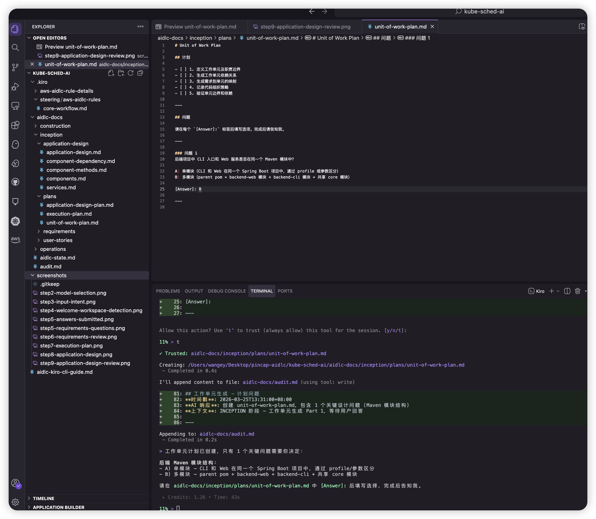

> 截图文件名：`step10-unit-of-work.png`

> 多模块结构让 CLI 和 Web 服务职责分离，共享 core 模块中的业务逻辑，是更清晰的工程组织方式。

---

## 第十一步：审阅工作单元拆分并进入 Construction 阶段

回答模块结构问题后，AI-DLC 自动完成工作单元拆分，生成文档：

```
aidlc-docs/inception/application-design/unit-of-work.md
```

### 工作单元拆分结果

本项目拆分为 2 个独立仓库、3 个工作单元：

**Unit 1: backend（后端服务 —— Maven 多模块）**

仓库名：`kube-sched-ai-backend`

Maven 模块结构：
```
kube-sched-ai-backend/     (parent pom)
├── kube-sched-ai-core/    (共享核心模块)
├── kube-sched-ai-web/     (Spring Boot Web 服务)
└── kube-sched-ai-cli/     (独立 CLI 入口)
```

- `kube-sched-ai-core`（共享核心）：EventParser、PromptBuilder、BedrockClient、ReportParser、ReportFormatter、AnalysisService、数据模型、Mock 数据
- `kube-sched-ai-web`（Web 服务）：AnalysisController、CORS 配置、依赖 core 模块
- `kube-sched-ai-cli`（CLI 工具）：CliRunner 独立 main 入口，不启动 Web 服务器

**Unit 2: frontend（前端应用）**

仓库名：`kube-sched-ai-frontend`，Vue 3 + Element Plus

**构建顺序：** core → web/cli（并行）→ frontend（独立）

### 确认并进入 Construction 阶段

确认无误后在 kiro-cli 中输入：

```
Approve & Continue
```

AI-DLC 进入 **Construction 阶段**，开始逐单元进行功能设计和代码生成。

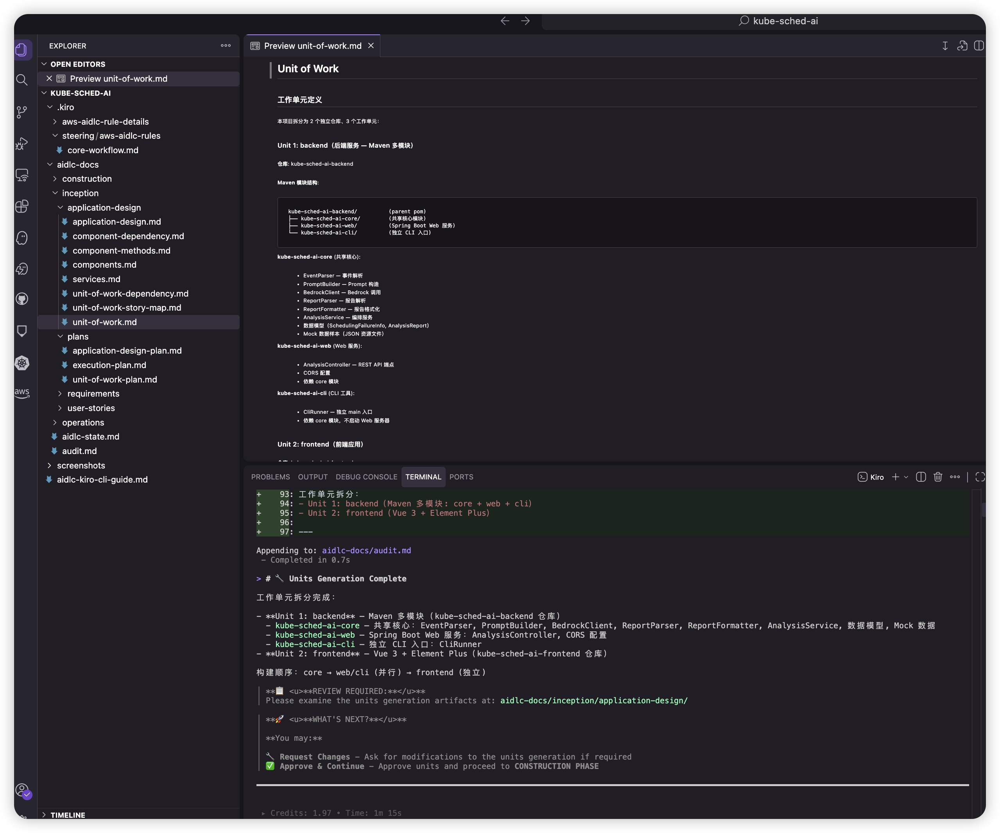

> 截图文件名：`step11-units-generation.png`

---

## 第十二步：Construction 阶段 —— 功能设计

工作单元确认后，AI-DLC 正式进入 **Construction 阶段**，状态从 INCEPTION 切换为 CONSTRUCTION，开始对 Unit 1（backend）进行功能设计。

自动生成功能设计问卷：

```
aidlc-docs/construction/plans/backend-functional-design-plan.md
```

功能设计计划包含 4 个步骤：
1. 定义领域实体和数据模型
2. 定义业务逻辑模型（事件解析、Prompt 构造、报告解析流程）
3. 定义业务规则（失败原因分类规则、输入验证规则）
4. 验证设计完整性

### 回答功能设计问题

共 3 个问题，本次演示回答如下：

| 问题 | 回答 |
|------|------|
| Q1 - 事件解析字段范围 | A）基础字段（Pod 名称、命名空间、调度失败消息、时间戳） |
| Q2 - AI 分析结果 JSON 结构 | A）简单结构 `{ "category": "...", "description": "..." }` |
| Q3 - 失败原因分类方式 | B）AI 自由生成，后端不做枚举约束 |

填写完成保存文件，回到 kiro-cli 告知完成。

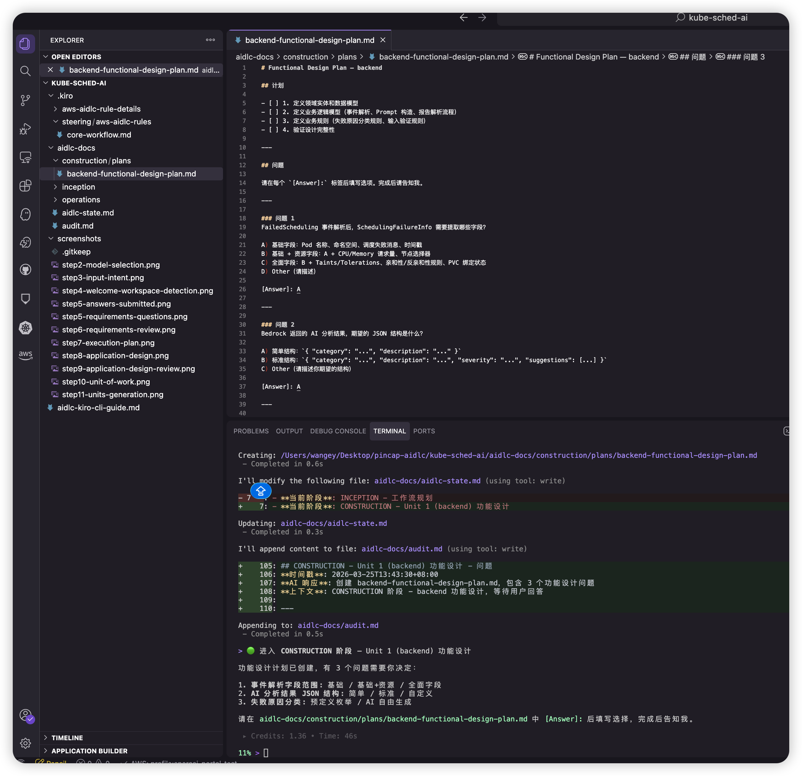

> 截图文件名：`step12-functional-design.png`

### 审阅功能设计文档

AI-DLC 根据回答生成以下功能设计文档，保存在：

```
aidlc-docs/construction/backend/functional-design/
```

生成了 3 个文件：
- `domain-entities.md` —— 3 个领域实体：`SchedulingFailureInfo`（4 个基础字段）、`AnalysisReport`（category + description 简单结构）、`EventRequest`
- `business-logic-model.md` —— 5 步分析流程：验证 → 解析 → 构造 Prompt → 调用 Bedrock → 解析报告
- `business-rules.md` —— 输入验证规则（4 条）、分类规则（AI 自由生成）、错误处理规则（3 种场景）

编辑器预览中可以看到完整的业务逻辑模型，分析流程如下：

```
EventRequest → validate → parse → buildPrompt → invoke Bedrock → parse AI response → AnalysisReport
```

### 确认并进入 NFR 需求阶段

确认无误后在 kiro-cli 中输入：

```
Continue to Next Stage
```

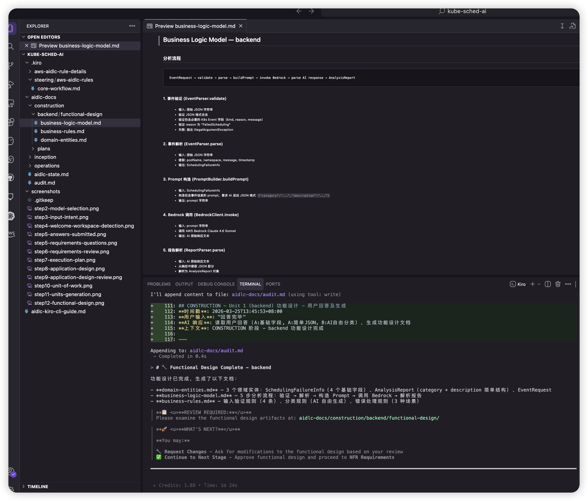

> 截图文件名：`step12b-functional-design-review.png`

---

## 第十三步：NFR 非功能需求确认

功能设计确认后，AI-DLC 进入 NFR（Non-Functional Requirements）需求阶段，生成问卷：

```
aidlc-docs/construction/plans/backend-nfr-requirements-plan.md
```

NFR 计划包含 3 个步骤：
1. 评估性能和可靠性需求
2. 确定技术栈细节
3. 生成 NFR 需求文档和技术栈决策文档

### 回答 NFR 问题

共 4 个问题，本次演示回答如下：

| 问题 | 回答 |
|------|------|
| Q1 - Bedrock 调用超时 | A）30 秒 |
| Q2 - Spring Boot 版本 | A）Spring Boot 3.3.x（当前稳定版） |
| Q3 - AWS Bedrock SDK | A）AWS SDK for Java v2（`software.amazon.awssdk:bedrockruntime`） |
| Q4 - 日志框架 | A）SLF4J + Logback（Spring Boot 默认） |

填写完成保存文件，回到 kiro-cli 告知完成。

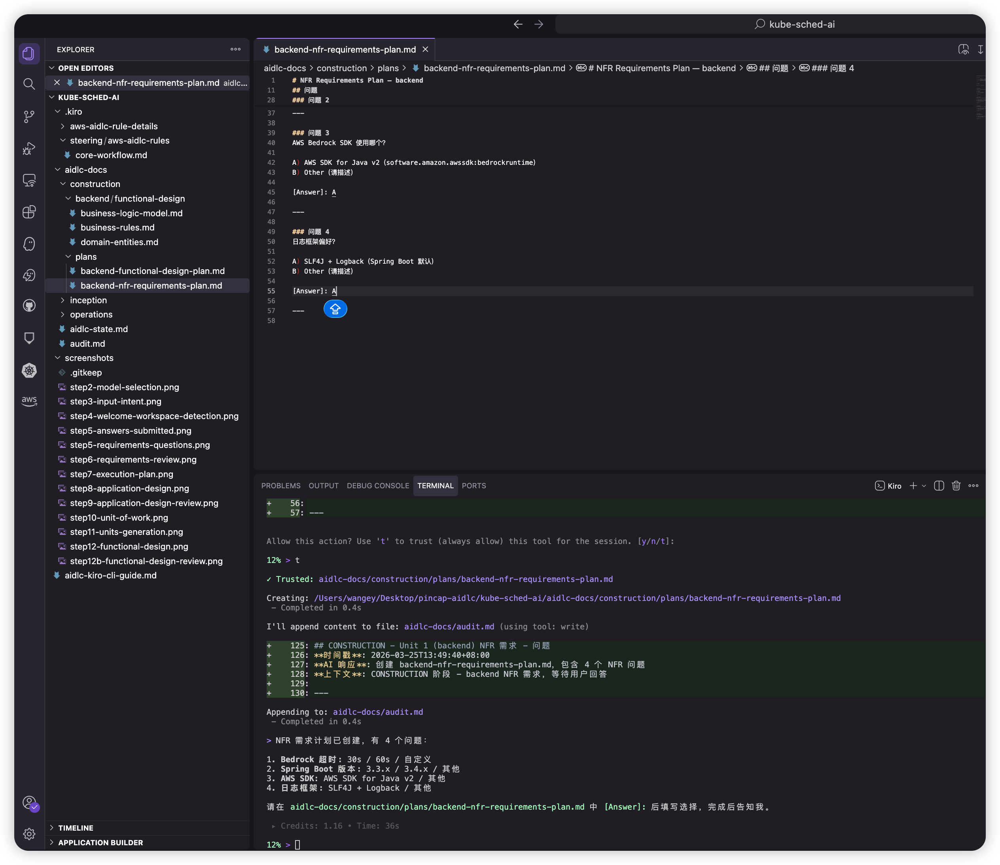

> 截图文件名：`step13-nfr-requirements.png`

---

## 第十四步：审阅 NFR 需求文档并确认

回答 NFR 问题后，AI-DLC 自动生成两个文档，保存在：

```
aidlc-docs/construction/backend/nfr-requirements/
├── nfr-requirements.md       ← NFR 需求文档
└── tech-stack-decisions.md   ← 技术栈决策文档
```

### 技术栈决策汇总

编辑器中可以看到完整的技术栈决策表：

| 技术 | 选择 | 版本 |
|------|------|------|
| JDK | OpenJDK | 23 |
| 框架 | Spring Boot | 3.3.x |
| 构建工具 | Maven | 3.9+ |
| AWS SDK | AWS SDK for Java v2（bedrockruntime） | Latest |
| AI 模型 | Claude 4.6 Sonnet（via Bedrock） | - |
| 日志 | SLF4J + Logback | Spring Boot 默认 |
| JSON 处理 | Jackson | Spring Boot 默认 |
| 测试 | JUnit 5 + Mockito | Spring Boot 默认 |

### NFR 需求评估结果

终端输出 NFR 需求评估完成摘要：

```
性能：Bedrock 调用超时 30 秒，API 总超时 35 秒
可靠性：三种错误场景（超时 503、解析失败 502、输入非法 400）均有明确处理策略
安全：MVP 无认证，AWS 凭证通过环境变量/credentials 文件
技术栈：OpenJDK 23 + Spring Boot 3.3.x + Maven + AWS SDK v2 + SLF4J/Logback
```

### 确认并进入 NFR 设计阶段

确认无误后在 kiro-cli 中输入：

```
Continue to Next Stage
```

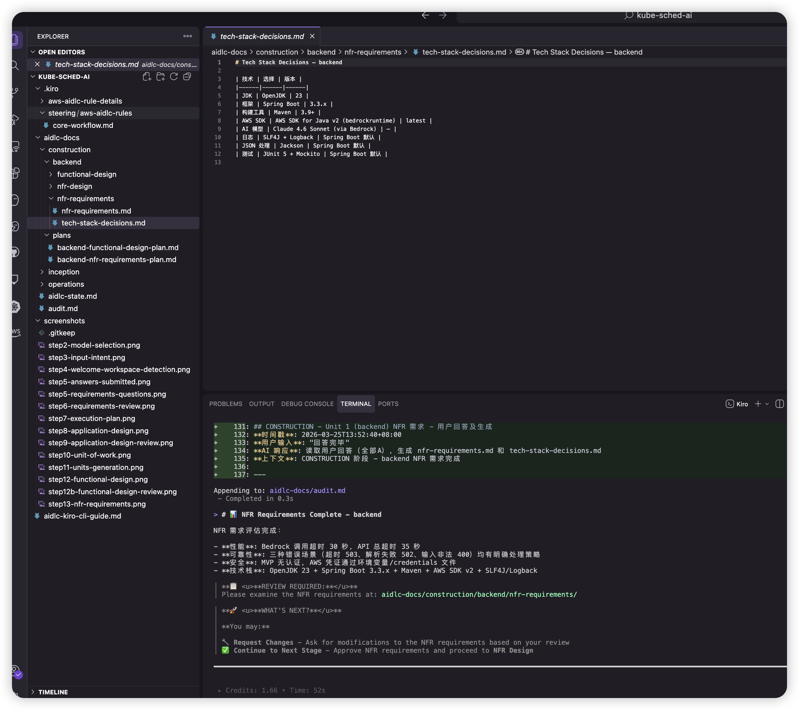

> 截图文件名：`step14-nfr-review.png`

---

## 第十五步：审阅 NFR 设计并进入代码生成

NFR 需求确认后，AI-DLC 自动完成 NFR 设计（无需额外问答），生成两个文档：

```
aidlc-docs/construction/backend/nfr-design/
├── logical-components.md    ← 逻辑组件设计
└── nfr-design-patterns.md   ← NFR 设计模式
```

### NFR 设计内容

共定义了 4 个设计模式：

- Bedrock 超时与错误处理：AWS SDK `apiCallTimeout(30s)` + 自定义异常映射
- 全局异常处理：`@RestControllerAdvice` 统一映射 400/502/503
- 结构化日志：无敏感 INFO 级别，错误场景 ERROR 级别
- CORS 配置：MVP 阶段放开所有来源

**逻辑组件清单：**

| 组件 | 类型 | 名称 |
|------|------|------|
| BedrockRuntimeClient | AWS SDK Bean | Spring Bean，配置超时和 region |
| GlobalExceptionHandler | @RestControllerAdvice | 统一异常到 HTTP 状态码映射 |
| CorsConfig | WebMvcConfigurer | CORS 跨域配置 |

**自定义异常类（3 个）：**
- `BedrockTimeoutException` —— Bedrock 调用超时
- `BedrockInvocationException` —— Bedrock 调用失败
- `ReportParseException` —— AI 响应解析失败

### 确认并进入代码生成阶段

确认无误后在 kiro-cli 中输入：

```
Continue to Next Stage
```

AI-DLC 进入 **代码生成阶段**。

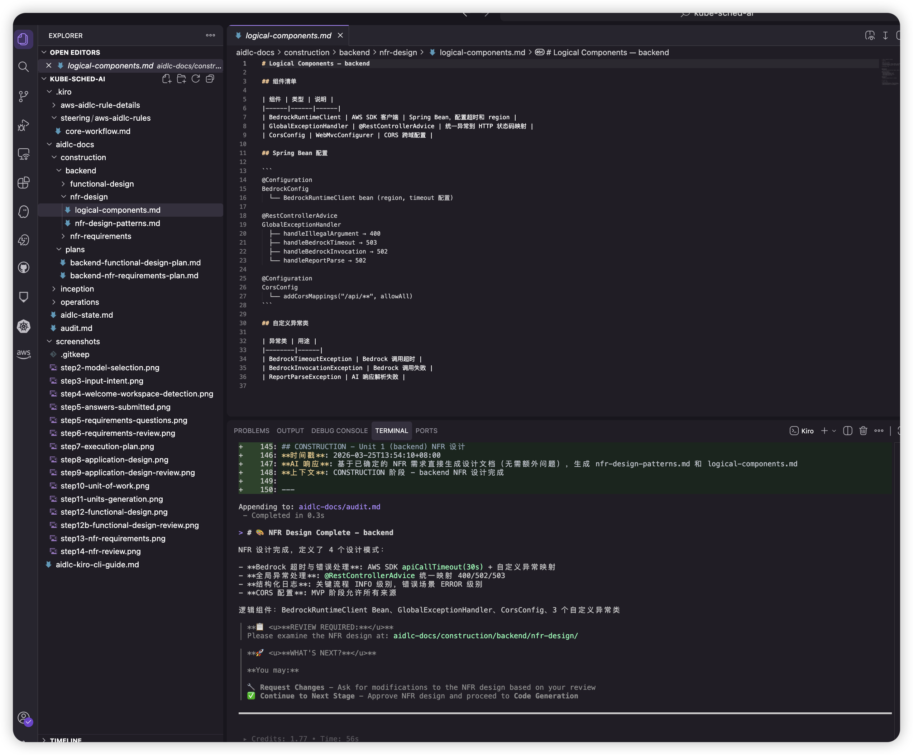

> 截图文件名：`step15-nfr-design-review.png`

---

## 第十六步：审阅代码生成计划并启动生成

NFR 设计确认后，AI-DLC 自动生成代码生成计划文档：

```
aidlc-docs/construction/plans/backend-code-generation-plan.md
```

### 代码生成计划（共 10 步）

**单元上下文：**
- 单元：backend（kube-sched-ai-backend）
- 项目类型：Greenfield，Maven 多模块
- 代码仓库：`/Users/wangey/Desktop/pincap-aidlc/kube-sched-ai/`
- 模块：core、web、cli
- 关联需求：FR-1 到 FR-7

**Part 1 —— 项目骨架（Step 1）：**
- Maven parent pom + 3 个子模块 pom

**Part 2 —— Core 模块（Step 2-6）：**
- 数据模型（3 个类）、自定义异常（3 个）、业务组件（5 个）、编排服务、Mock 数据

**Part 3 —— Web 模块（Step 7）：**
- REST Controller、异常处理、CORS、Bedrock 配置、启动类

**Part 4 —— CLI 模块（Step 8）：**
- 独立 CLI 入口

**Part 5 —— 测试与文档（Step 9-10）：**
- 5 个单元测试类 + 代码摘要文档

### 确认并启动代码生成

仔细阅读代码生成计划，确认无误后在 kiro-cli 中输入：

```
Approve & Start Generation
```

AI-DLC 开始按计划逐步生成所有代码文件。


> 截图文件名：`step16-code-generation-plan.png`

---

## 第十七步：代码生成执行完成

确认代码生成计划后，AI-DLC 按步骤逐一生成所有代码文件。

### 后端代码生成完成

生成的完整项目结构：

```
kube-sched-ai/
├── pom.xml                              (parent)
├── kube-sched-ai-core/
│   ├── pom.xml
│   └── src/main/java/com/kubesched/core/
│       ├── model/                       (3 个 record 类)
│       ├── exception/                   (3 个自定义异常)
│       ├── component/                   (5 个业务组件)
│       └── service/
│           └── AnalysisService.java
├── kube-sched-ai-web/
│   ├── pom.xml
│   └── src/main/java/com/kubesched/web/
│       ├── WebApplication.java
│       ├── config/
│       └── controller/
│           ├── AnalysisController.java
│           └── GlobalExceptionHandler.java
└── kube-sched-ai-cli/
    └── src/main/java/com/kubesched/cli/
        └── CliRunner.java
```

### 前端代码生成完成

前端代码生成完成，共创建 7 个文件：

**项目配置（3 文件）：**
- `package.json` —— Vue 3、Element Plus、Vite 6、Axios
- `vite.config.js` —— 开发代理 localhost:3000 → localhost:8080
- `index.html`

**应用代码（4 文件）：**
- `src/main.js` —— Vue + Element Plus 初始化
- `src/App.vue` —— 根组件，带蓝色 header
- `src/api/analysis.js` —— 调用 `POST /api/v1/analysis`
- `src/views/AnalysisView.vue` —— 主页面：JSON 输入 textarea + 分析按钮 + El-Descriptions 报告展示 + 错误提示

### 确认并进入构建与测试阶段

确认无误后在 kiro-cli 中输入：

```
Continue to Next Stage
```

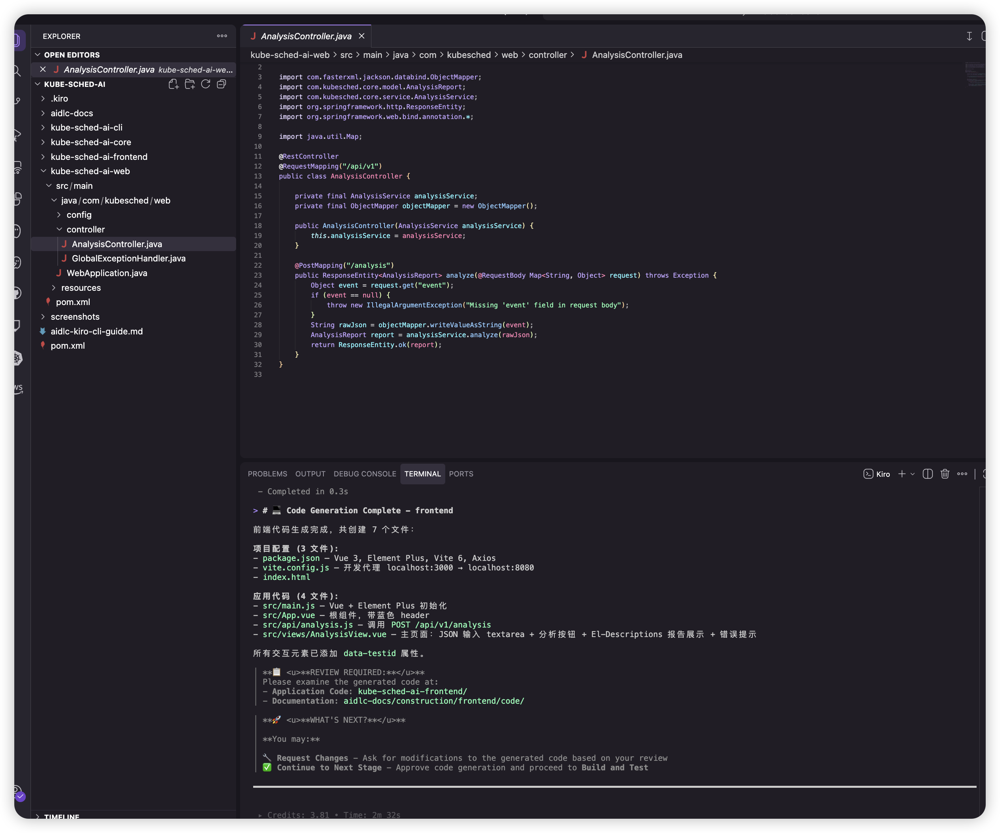

> 截图文件名：`step17-code-generation-complete.png`

---

## 第十八步：构建与测试

代码生成全部完成后，AI-DLC 自动进入构建与测试阶段，生成以下文档：

```
aidlc-docs/construction/build-and-test/
├── build-instructions.md           ← 构建指令
├── unit-test-instructions.md       ← 单元测试（13 个测试，5 个测试类）
├── integration-test-instructions.md ← 集成测试场景（API curl、前后端联调、错误处理）
└── build-and-test-summary.md       ← 综合摘要
```

### 快速启动命令

AI-DLC 生成了完整的启动步骤：

**第一步：构建后端**
```bash
mvn clean install
```

**第二步：启动后端**
```bash
java -jar kube-sched-ai-web/target/kube-sched-ai-web-1.0.0-SNAPSHOT.jar
```

**第三步：启动前端**
```bash
cd kube-sched-ai-frontend && npm install && npm run dev
```

### Construction 阶段完成

至此，Construction 阶段全部完成。Operations 阶段目前为占位符，项目已可以开始构建和测试。

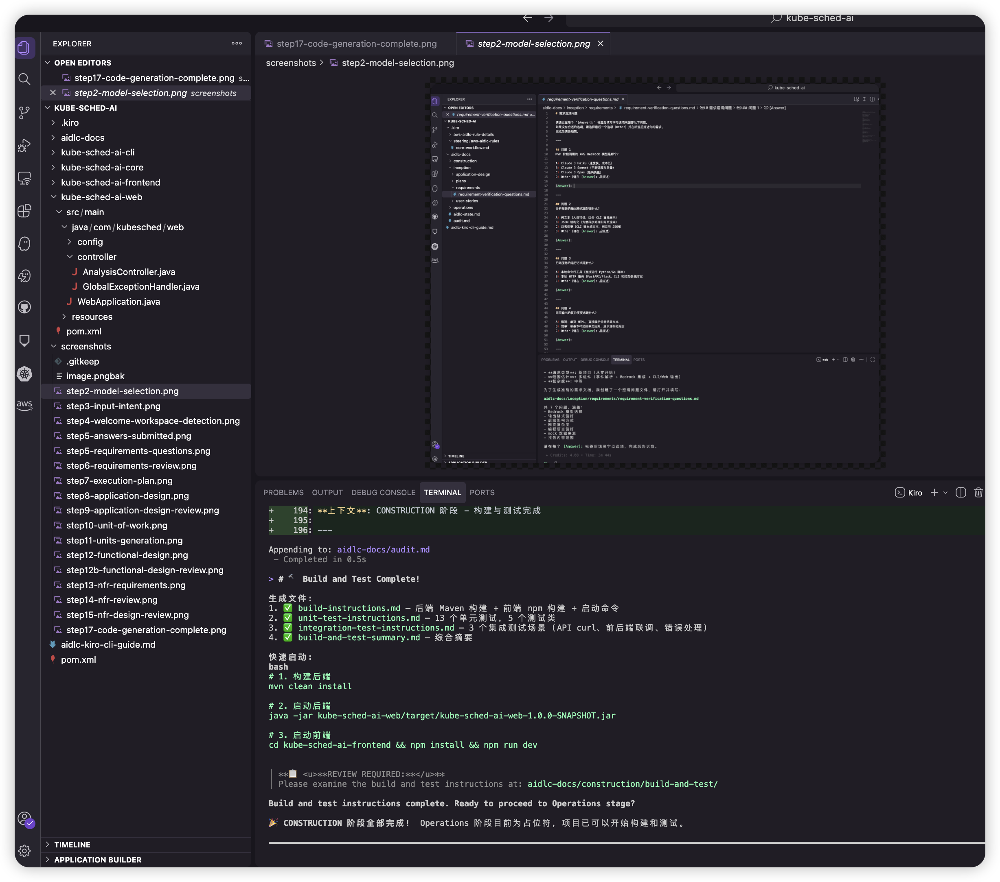

> 截图文件名：`step18-build-and-test.png`

---

## 注意事项

- AI-DLC 所有生成的文档和计划会保存在项目的 `aidlc-docs/` 目录下
- 每个阶段都需要人工审核并确认后才会进入下一阶段，保持人工控制
- 如果 kiro-cli 提示切换到 spec 模式，选择 **No** 以保持在 Vibe 模式下运行 AI-DLC
- 代码生成过程中如频繁出现 `Allow this action?` 提示，下次可用 `kiro-cli --trust-all` 启动以跳过所有确认
