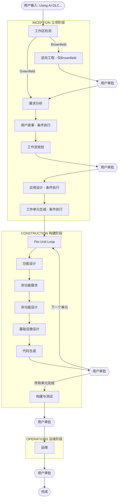

# AI-DLC 工作流程图

## 完整流程图



---

## 关键决策点说明

### ⭐ 技术栈在哪个阶段选择？

技术栈选择分两步：

1. **需求分析阶段（Inception）** — 初步确定技术方向
   - 通过结构化问卷收集偏好
   - 评估现有技术栈约束（Brownfield）
   - 确定大方向（如：前端框架、后端语言、数据库类型）

2. **NFR需求阶段（Construction）** — 最终确认技术栈
   - 结合性能、安全、扩展性要求做最终决策
   - 明确具体版本和配置

---

## 自适应深度说明

AI-DLC 不是每次都走完所有阶段，而是根据复杂度自动调整：

| 场景 | 跳过的阶段 |
|------|-----------|
| 简单 Bug 修复 | 用户故事、应用设计、单元生成、NFR系列、基础设施设计 |
| 新功能开发 | 逆向工程（Greenfield）、部分NFR阶段 |
| 全新复杂系统 | 几乎不跳过任何阶段 |
| 已有系统改造 | 逆向工程必须执行 |

---

## 产出物目录结构

```
aidlc-docs/
├── inception/
│   ├── requirements/        # 需求文档
│   ├── user-stories/        # 用户故事
│   ├── application-design/  # 应用设计
│   └── reverse-engineering/ # 逆向工程文档（Brownfield）
├── construction/
│   ├── {unit-name}/
│   │   ├── functional-design/
│   │   ├── nfr-requirements/
│   │   ├── nfr-design/
│   │   ├── infrastructure-design/
│   │   └── code/
│   └── build-and-test/
├── aidlc-state.md           # 当前工作流状态
└── audit.md                 # 完整审计日志
```
